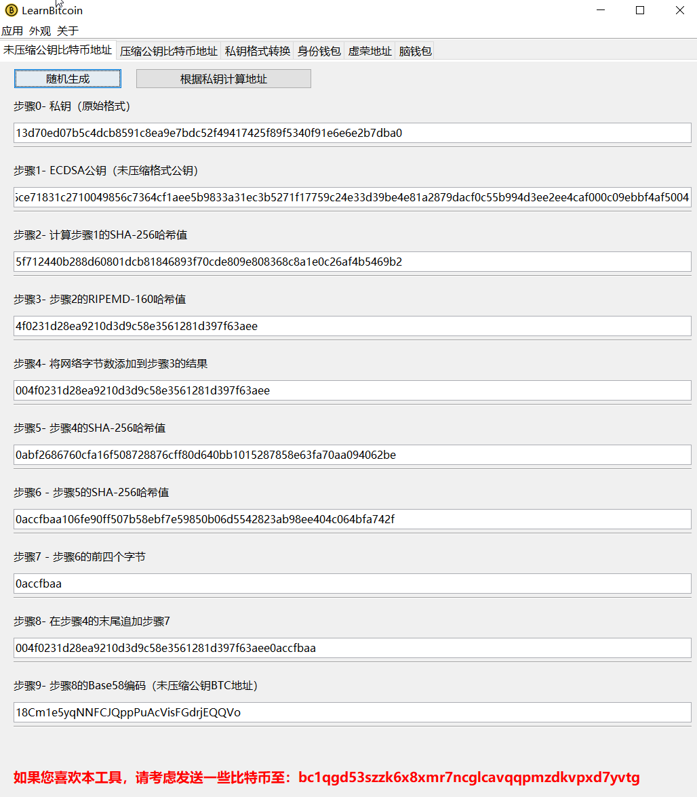
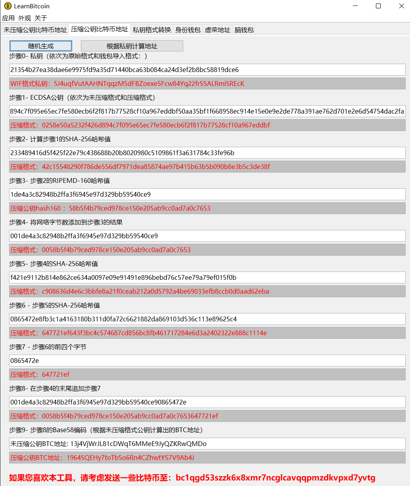
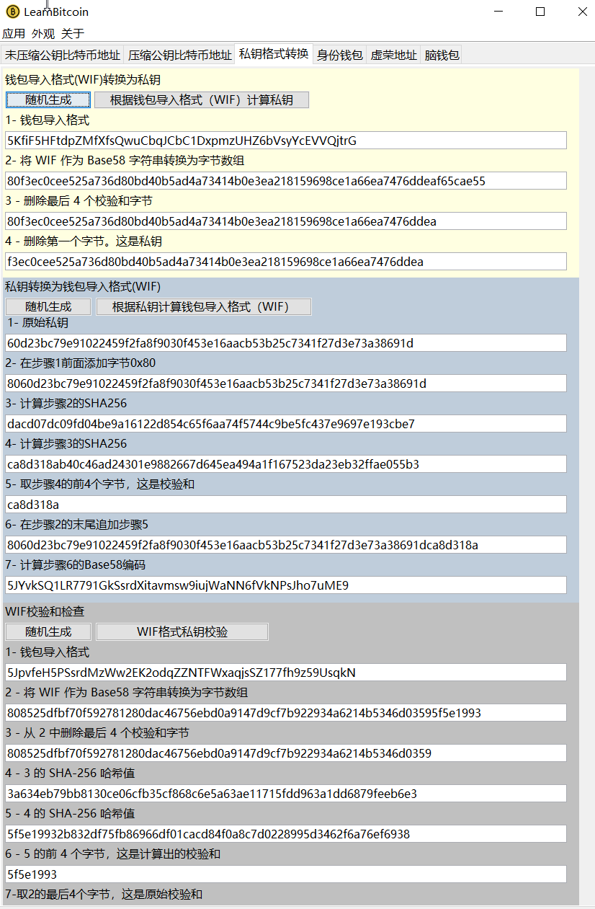

# LearnBitcoin

比特币地址生成工具

## 支持的操作系统

## 截图

更多主题:

## 下载
[https://github.com/anonymous2100/learnBitcoin/releases](https://github.com/anonymous2100/learnBitcoin/releases)  

## 感谢
本工具界面主题字体等设计参考了以下项目：

[MooInfo](https://github.com/rememberber/MooInfo)   
[TP's Go Bitcoin Tests](https://gobittest.appspot.com/) 
